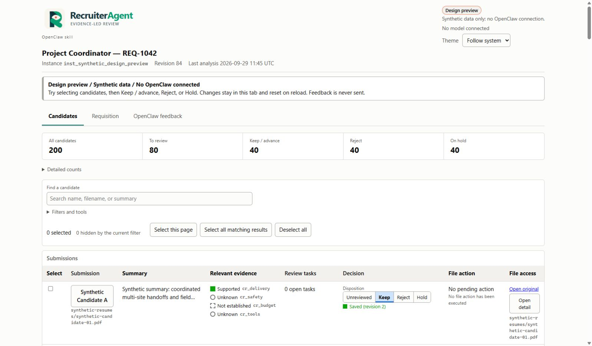
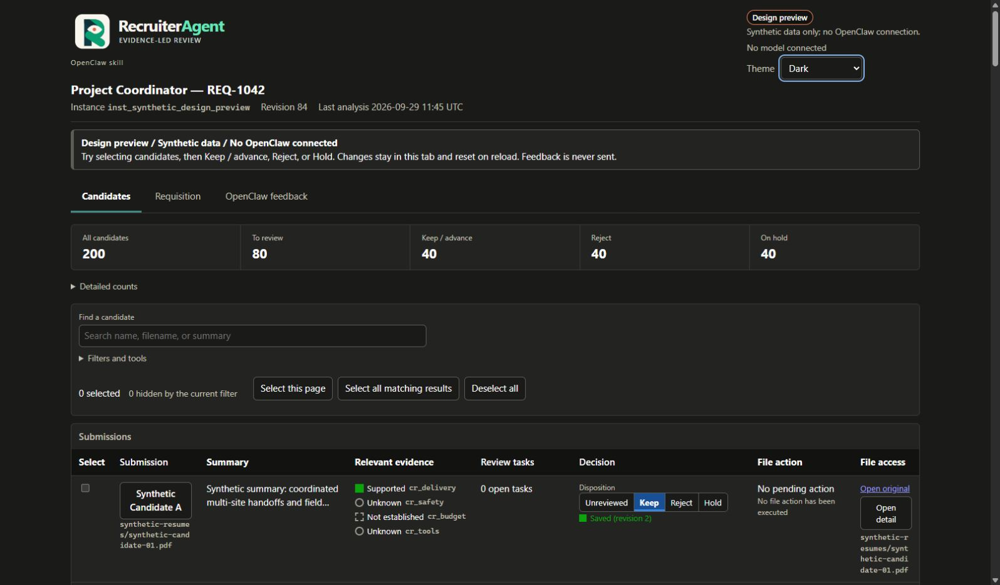

# RecruiterAgent


**Cut through high volumes of applications with agentic AI and evidence-backed
review, curated by humans.**

RecruiterAgent is an OpenClaw skill with a companion HTML review workspace.
Review applications against a requisition, inspect supporting evidence, and
curate candidates with Keep / advance, Hold, and Reject decisions. Humans retain
control of criteria and decisions, and approve the exact plan before files move.

[Open the companion HTML app](https://recruiteragent.airanger.dev/recruiteragent-design-preview)
· [Installation guide](skill/references/install.md)
· [MIT license](LICENSE)
· [Hackathon submission setup](submission/README.md)

The companion app is a design preview with 200 synthetic candidates. Its feedback
and review edits stay in the browser tab; it is not a live OpenClaw connection.
The installable product provides a connected helper and restricted analysis
adapter. Live OpenClaw engagement still requires operator setup and verification.

## Companion app screenshots

The screenshots below show the Fold branding in the local synthetic preview.
They contain no real applicant data. Cloudflare deployment of this branding is
pending a successful operator deployment.



<details>
<summary>Dark mode</summary>



</details>

The workspace groups candidate review, the requisition reference, and OpenClaw
feedback into tabs. Detailed counts and filters are collapsible. The agent
declarations are available separately without crowding the landing view.

## RecruiterAgent source package for OpenClaw

The repository includes an OpenClaw skill and the application source. Build the
portable skill directory with:

```powershell
python tools/build_openclaw_package.py --output dist/RecruiterAgent
```

Choose a fresh output directory for subsequent builds. Install that prepared
directory into OpenClaw, then run its Python installer:

```text
openclaw skills install ./dist/RecruiterAgent --as recruiteragent
python "<installed-skill-directory>/scripts/install.py"
python "<installed-skill-directory>/scripts/run.py" -- --help
```

Python 3.12+ and OpenClaw are host prerequisites. `requirements.txt` installs the
application and runtime dependencies using the tested lock constraints; Python
packages/binaries are fetched by pip instead of being bundled. The skill's
`--demo` installer option additionally builds a synthetic preview. The source
package excludes downloaded resume corpora, credentials, databases, virtual
environments, generated real-data previews, and dependency binaries. Installation
and runtime verification are separate from live OpenClaw analysis, which requires
an approved restricted route and operator configuration. See
[skill/references/install.md](skill/references/install.md) for the complete steps.

Point it at a folder of resumes. It gives you a reviewable list with
evidence-backed summaries, keeps your decisions, and organizes only the files you
explicitly approve.

One job folder is one instance: its own database, its own generated report, its
own criteria, its own review history, its own file-action journal. Copy the folder
and you have moved the instance. Nothing requires a server, a cloud database, or a
network connection to be useful.

**Authority:** [`docs/PRD.md`](docs/PRD.md) is the specification.
[`docs/AGENT_BUILD_HANDOFF.md`](docs/AGENT_BUILD_HANDOFF.md) is the build
directive. [`AGENTS.md`](AGENTS.md) carries the constraints a change must not
break. This README summarizes; it does not override them.

---

## The four ideas that shape the design

**A decision is not a file move.** Unreviewed / Keep / Reject / Hold is a human
judgment recorded in the database. It moves nothing. Separately, you build an
exact plan, approve that plan, and execute it. A file that is marked Reject sits
exactly where it was until you approve the move.

**Unknown is not negative.** If the processed document does not establish a
criterion, the result is *not established in this document* — never "does not
have", and never a rejection. Scanned, encrypted, corrupt, and oversized inputs
become manual-review items that stay visible. They are never auto-rejected.

**No model moves a file.** The analysis route gets bounded text and returns
structured output with source locators. It has no shell, no write access, and no
approval credential. The helper validates its output, and a separate deterministic
executor performs filesystem operations — never a copy-and-delete fallback, never
an overwrite.

**One writer, on the machine that holds the folder.** SQLite stays beside the
resumes. Reviewers reach the helper over the network through the API; they never
open the live database through a mapped drive.

---

## What is deliberately absent

No ATS replacement, email intake, candidate outreach, scheduling, background
checks, social enrichment, autonomous hiring decisions, opaque suitability scores,
or permanent deletion. No mandatory cloud database, vector database, Redis, message
broker, or frontend build step. No inference from photographs, no demographic or
personality scoring, no inferred sensitive traits, no aggregate fit ranking.

Deletion is recoverable Trash only. Retention settings create review tasks; they
do not silently destroy anything.

---

## Requirements

* Python 3.12 or later (developed and tested on 3.14).
* A supported browser.
* Storage local to the machine hosting the folder. A network share is rejected by
  setup rather than silently degraded — see `docs/shared-host-operation.md`.

## Install

```bash
python -m venv .venv
.venv/Scripts/python -m pip install -e .        # Windows
.venv/bin/python -m pip install -e .            # POSIX
```

Exact tested versions are pinned in `requirements.lock`; the compatibility matrix
is in `docs/compatibility.md`.

## Commands

These are product commands implemented by this repository. They are not existing
OpenClaw CLI functions.

```bash
resume-review setup         --folder <root> --job <job-description-file>
resume-review start         --instance <id>
resume-review status        --instance <id> --json
resume-review scan          --instance <id>
resume-review summarize     --instance <id> --changed-only
resume-review render        --instance <id>
resume-review plan-actions  --instance <id> --request <json-file>
resume-review apply-actions --instance <id> --batch <approved-batch-id>
resume-review backup        --instance <id>
resume-review repair        --instance <id> --dry-run
resume-review stop          --instance <id>
```

Machine-readable output uses the envelope in
[`schemas/api_envelope.schema.json`](schemas/api_envelope.schema.json):
`ok`, `code`, `instance_id`, `data`, `warnings`, `request_id`. Exit codes
distinguish success, invalid input, permission failure, conflict, dependency
failure, and unsupported storage.

`apply-actions` cannot manufacture approval. It succeeds only for a still-valid
approval already recorded through the review interface, and the analysis agent
never receives that credential.

## Test

The default suite is synthetic-only: it never reads the real-resume corpus kept
(gitignored) under `resume/`. That corpus is opt-in per run and never committed;
see [`docs/corpus.md`](docs/corpus.md).

```bash
python -m pytest                # synthetic suite (default; never reads resume/)
python -m pytest -m "not slow"  # fast subset
python -m pytest -m live        # needs a live restricted OpenClaw route; skipped by default
RESUME_REVIEW_REAL_CORPUS=1 python -m pytest -m corpus   # opt-in real corpus (POSIX)
```

On Windows PowerShell, set the flag first:
`$env:RESUME_REVIEW_REAL_CORPUS = "1"; .venv/Scripts/python.exe -m pytest -m corpus`.
Without the flag, the corpus tests skip cleanly rather than run.

## Layout

```text
src/resume_review/
    bootstrap/     provisioning, ownership lock, release integrity
    api/           HTTP surface, request/response contracts
    auth/          sessions, roles, CSRF, Origin/Host guards
    db/            connection, migrations, repositories
    ingest/        discovery, stabilization, PDF/DOCX/TXT extraction
    analysis/      two-stage analysis, evidence validation, filter compiler
    openclaw_adapter/  the restricted analysis route
    actions/       plan -> approve -> apply, journal, crash reconciliation
    storage/       no-clobber moves, path containment, topology detection
    reporting/     self-contained snapshot and connected report
    security/      untrusted-content handling
web/               report template and assets
schemas/           versioned JSON contracts
tests/             unit, integration, security, recovery, browser, corpus, fixtures
docs/              PRD, contracts, runbooks, ADRs, acceptance report
skill/             the reusable OpenClaw skill
```

## Current status

The dashboard uses the RecruiterAgent Fold identity. Original vector and raster
artwork and usage notes are in [branding/README.md](branding/README.md). Header
logos and the favicon are embedded in the report template so exported snapshots
remain self-contained. Light/dark artwork follows the selected page theme, and
compact logos are used on narrow screens.

RecruiterAgent source is [MIT licensed](LICENSE). Dependencies retain their own
licenses. The license does not grant redistribution rights to applicant resumes;
source releases exclude applicant data and downloaded dependencies.

Agent Index submission materials and reporting setup are in
[submission/README.md](submission/README.md). RecruiterAgent is
[registered on the Agent Index](https://aiworthusing.com/agent-index/recruiteragent).
The skill and dedicated usage reporter were installed on a hosted Plow OpenClaw
instance on 2026-09-29. Dependency verification, model discovery, registration,
and a scheduled report succeeded. Real recruiting engagement, a demo video,
and hackathon verification remain operator steps. A separate Docker instance can follow the
[Plow OpenClaw setup guide](submission/plow-openclaw.md).

See [`docs/acceptance-report.md`](docs/acceptance-report.md) for which acceptance
tests pass with recorded evidence, which are implemented but not yet verified, and
which are **not implemented**. That file is the honest answer; nothing here claims
a component works because its interface exists.
